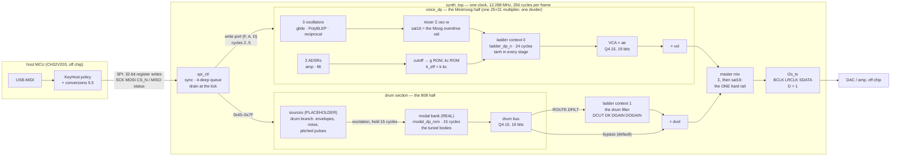

# The chip: architecture

**Status: PROPOSED.** This is the document to implement from: the block
diagram, the signal path from the SPI pins to the I2S pins, the 256-cycle
frame schedule, what shares which multiplier, the clock and reset scheme, the
pins and the register map — and, at the end, what is measured, what is
derived, and what is not done. It is realised in `rtl-sketch/synth_top.v`,
which synthesises to gf180mcu and runs through its pins in
`rtl-sketch/tb_synth_top.v`. Every number is labelled measured, derived or
estimated. Ratification is the two-key act this fleet uses and is not claimed.

The product (DR 0002 and the sponsor's decisions on issue 1): a
keychain-sized, USB-C bus-powered, class-compliant USB-MIDI sound module —
**a Minimoog and a TR-808 in one chip** — with a CH32V203 MCU owning USB and
talking to this chip over SPI (DR 0007). Capacitive touch is cut
(`DESIGN.md` section 10). The chip is paraphonic (DR 0003), has a drum
section whose tuned bodies are the modal bank, and leaves as I2S.

---

## 1. Block diagram

Two busses that meet once, late, at one saturation point. The Minimoog half
is defined by mixer-into-filter overdrive and one fat voice; the 808 half by
resonant bodies pinged by transients. They share nothing but the clock, the
ladder's arithmetic (as a second *context*, never the same state) and the
master mix; that is what lets each sound like itself.

---

## 2. Blocks, and what each one is

| block | file | what it is | status |
|---|---|---|---|
| `spi_ctl` | `rtl-sketch/spi_ctl.v` | the link of DR 0007: two-flop synchronisers, a 32-bit shift register, a 4 × 32-bit write queue, the status word on MISO, the drain that applies queued writes one per cycle at the start of a frame | real; driven through the pins by `tb_synth_top.v` (pin-to-acceptance 3 cycles, drain in cycles 2..5, both measured) |
| `voice_dp` | `rtl-sketch/voice_dp.v` | the whole voice of the contract: three oscillators with glide and PolyBLEP, mixer, two ADSRs, the cutoff path with the g and kc ROMs, the ladder (two contexts), the VCA, the volume, the master mix with the drum bus | real; **bit-exact against `model/voice_fx.py`** at the register port over 43 200 frames of three scenarios (`verify_voice.py`, section 9) |
| `ladder_dp_n` | `rtl-sketch/ladder_dp_n.v` | Huovilainen's ladder, one datapath, NCH state sets; context 0 is the voice, context 1 the drum filter | real; bit-exact against `model/fixed.py` on every channel at NCH = 2 and 4, 19-bit output (section 9) |
| `recip_div` | `rtl-sketch/recip_div.v` | the PolyBLEP reciprocal `floor(2^31 / m)` by restoring division, 19 cycles | real; covered by the voice's bit-exactness (every glide frame recomputes it) |
| `drum_section_placeholder` | in `synth_top.v` | **PLACEHOLDER SOURCES**: eight trigger bits, one decaying noise burst; **REAL BODIES**: `modal_dp_rom`, eight stored bars | the `drums` branch replaces the sources; the bank is bit-exact against `model/modal_fixed.py` |
| `i2s_tx` | `rtl-sketch/i2s_tx.v` | the contract's section 13 transmitter (the sibling's), driven by the frame counter | real; decoded by `tb_synth_top.v` as a DAC does, 2 657 words, 0 mismatches, D = 1 |
| `synth_top` | `rtl-sketch/synth_top.v` | the frame counter, tick, go, reset synchroniser, RESET decode, the overrun flag, the instances | real |

Three ROMs live in `voice_dp` and read the contract's pinned images directly
(`spec/reference/tables/{g_rom128,k_rom32,sine_q256}.hex`, `$readmemh`), so
`gen_tables.py --check` guards the RTL's tables too; the ladder's `tanh16.hex`
is guarded the same way already.

---

## 3. The signal path, pin to pin

1. **SPI → register.** A 32-bit transaction `{F, A[6:0], D[23:0]}` is accepted
   at the synchronised `CS_N` rising edge (DR 0007 section 5) and queued. At
   the next tick the queue drains: each write lands on the register port
   `{wr_valid, wr_flag, wr_addr, wr_data}` in cycles 2..5, and `voice_dp` or
   the drum section decodes it. RESET (0x23) is a one-cycle synchronous reset
   of every datapath register and nothing on the link.
2. **Oscillators** (contract 6): each of the three reads its phase, forms the
   naive wave, applies up to four PolyBLEP windows (two multiplies each) and
   advances its phase. The reciprocal `(sh, r)` is recomputed by the divider
   at the start of any frame in which the increment changed (a jump, or a
   glide step in the previous frame).
3. **Mixer** (7): `Σ osc_k · w_k`, exact, then `>> 15` and `sat16` — the
   Q1.15 rail of the filter's input, the Minimoog's mixer overload (DR 0005).
4. **Envelopes and cutoff** (8, 10): `ae`, `fe` from the levels before this
   frame's update; `cut = clamp(cut_lo + (span · fe >> 15) + track_hz)`,
   then `g` and `kc` by interpolation from the ROMs, `k_eff = min(k · kc >>
   15, 2^17 − 1)`.
5. **Ladder, context 0** (11): 24 cycles on `mixed` with `g, k_eff, gain,
   ogain`; 19-bit Q4.15 out. While it runs, the voice's multiplier is idle,
   so the envelope updates and glide slews (step 9 of 4.2) and the drum
   filter's coefficients (`DCUT` → `g2`, `kc2`, `k_eff2 = DK · kc2`) are
   computed then.
6. **The drum section** ran in parallel from `go`: its sources compute this
   frame's excitation, the modal bank rings on it for 15 cycles, and the
   19-bit drum bus is marked `drum_done`. Section 5 states the ordering rule.
7. **Ladder, context 1 — the drum filter** (ROUTE.DFILT = 1 only): once
   context 0 is done and `drum_done` is set, `sat16(drum_bus)` runs the same
   24-cycle ladder on the second state set with `g2, k_eff2, DGAIN, DOGAIN`.
   Meanwhile the VCA and volume of step 8 use the multiplier.
8. **VCA and volume** (9, 12): `v = (y19 · ae) >> 15`, `out_v = (v · vol) >>
   15`; 20 bits, no clamp.
9. **Master mix, the one rail**: `sample = sat16(out_v + ((d19 · dvol) >>
   15))`, where `d19` is the drum bus, filtered or not. Both busses arrive
   wider than 16 bits (the voice at 20, the drums at 19 scaled to 20), so
   lowering a bus level can always recover a peak; nothing clamps to 16 bits
   before this point except the two filter *inputs*, which are the
   designed overdrive rails.
10. **I2S** (13): the sample strobed in frame f is loaded at cycle 255 of
    frame f and transmitted in LRCLK period f+1, left-justified in 32-BCLK
    slots, same word on both channels. `D = 1`.

---

## 4. Topology decisions — deliberate, not defaulted

The sponsor asked for four orderings to be decided explicitly. Each is a
choice with a stated alternative.

### 4.1 Drums do not pass through the voice's filter; they may pass through a second filter context

**Default: the drum bus bypasses every filter and meets the voice at the
master mix.** Closing the bass's cutoff must not muffle the hi-hats, and
driving the ladder harder must not distort bass and drums together.

**`ROUTE.DFILT` (0x0F bit 0) sends the drum bus through the *drum filter*** —
the same ladder arithmetic on a second, independent state set
(`ladder_dp_n`, NCH = 2), with its own static cutoff `DCUT` (no envelope, no
tracking; the host sweeps it by writing it), resonance `DK` (compensated by
the same kc ROM at `DCUT`), `DGAIN` and `DOGAIN`. Filtered 808 is a sound
people want, and this is the honest way to give it:

- *Rejected: drums into the voice's mixer.* The voice's VCA is after the
  filter (DR 0005), so drums through the voice's filter are also drums
  through the voice's amplitude envelope: releasing the bass note mutes the
  ringing drums. That is the Minimoog's External Input behaviour — a real
  effect, "shared articulation" — but it is not what "filtered drums" means,
  and it should not be the only reading of a routing bit. It is not offered
  in this revision; it could be added as a second ROUTE bit later without
  changing anything here.
- *Cost of the second context, measured:* `ladder_dp_n` at NCH = 2 is
  137 960 µm² of cells against 114 254 for NCH = 1 inside this top
  (+23 706 µm², +0.024 mm²; `area-budget.md` section 2.2 measured +25 719
  standalone), plus the four coefficient registers, plus 24 cycles per
  frame when engaged. Cells, not a routed result.
- The drum filter's input is `sat16(drum_bus)`: the ladder's input word is
  Q1.15, and its rail is the same designed mixer-overload rail the voice
  has (contract 12, clamp 2). A drum bus above 1.0 into the filter overdrives
  the filter, which is the effect.
- **Which drum bus, now that there are two.** DR 0008 gives the section two
  buses, `dmix` (21 bits) and `body` (19 bits), with a gain each. The drum
  bus this bit routes is the two **already scaled and summed**:
  `dacc = dmix·dvol + body·bvol` exactly, and the filter's input is
  `sat16(dacc >> 15)`. The gains therefore balance the kit *before* the
  filter, which is what you want — how hard the filter is driven depends on
  the mix — and there is still exactly one rail at the output. In bypass the
  master mix takes `dacc` at full width (contract 12 verbatim); with DFILT it
  takes the filter's output word at unity, `d19 << 15`, and `DOGAIN` is that
  path's level. Filtering one bus and not the other was considered and
  rejected: the split between `dmix` and `body` is *how a voice is made*
  (metallic voices versus resonators), not a send, and a routing bit that
  filtered the hats but not the kick would be a surprise, not a feature.

### 4.2 The modal bank sits inside the drum path

It is the tuned drum bodies, excited by the drum sources and summed into the
drum bus — not a third parallel voice. **The placeholder is gone**: since
2026-09-18 `synth_top.v` instantiates `drum_regs` + `drum_kit` (`drum_dp` +
`modal_dp`), the engine `verify_drums.py` shows bit-exact against
`model/drums_fx.py`, and `verify_synth_top.py` shows the whole chip bit-exact
at the pins. The shape is unchanged: sources → excitation → modal bank → the
two drum buses. If the concurrent
TR-808 research (branch `docs/tr808-reference`) confirms that the bass drum,
toms, congas, claves and rimshot are bridged-T resonators, then most of the
808 *is* the modal bank and the sources are mostly excitation pulses plus the
metallic voices (hats, cowbell, cymbal); the drum branch should design for
that, and the bank then needs enough simultaneously ringing bodies, which is
the drum branch's sizing question. **Scoping consequence:** the "cut the
modal bank first" policy recorded on issue 1 must then distinguish *required
percussion bodies* from *optional struck-bar presets*; `DESIGN.md` section 10
says so, and this document does not treat the bank as optional.

### 4.3 Gain structure between the two busses — measured

Drums are transient and peaky; the bass is sustained and loud. The
allocation, with numbers from `rtl-sketch/headroom_check.py` (the integer
voice on the eight audition patches at the reference `vol` = 0.45; the modal
bank at a full-scale strike; the only drum material that exists):

| bus | material | peak at the master mix |
|---|---|---:|
| voice, `vol` = 0.45 | loudest audition patch, `growl-bass` | 0.86 FS (−1.3 dBFS) |
| voice, `vol` = 0.45 | the other seven patches | 0.19–0.53 FS (−14.6 to −5.5 dBFS) |
| drum bus before `dvol` | modal bank, full-scale strike, note 28 / 40 / 52 / 64 | 0.64 / 0.33 / 0.17 / 0.09 FS |
| sum | `growl-bass` + a bar at note 40 every 0.5 s and one at note 64 every 0.25 s, `dvol` = 0.5 | 0.88 FS, **0 samples clipped** of 134 400 |
| sum | the same at `dvol` = 0.71 | 0.95 FS, 0 clipped |

**Allocation:** the voice keeps the contract's reference (`vol` = 0.45,
worst patch −1.3 dBFS); the drum bus reference is **`dvol` = 0.5 (16384)**,
which puts the loudest body's full strike at −9.9 dBFS and the measured
pattern's sum at 0.88 FS with nothing clipped. The worst *coincidence* the
numbers allow — `growl-bass`'s peak and a note-28 full strike in the same
sample — is 0.86 + 0.32 = 1.18 FS, 1.4 dB into the rail; that is the host's
to avoid by its levels, exactly DR 0005's policy for the voice alone ("rather
than limit the outputs … we allow you to adjust levels"). **This table must
be re-run on the drum branch's sources** when they exist; the script takes
them as its input. There is no limiter and no soft clipper (DR 0005).

Two bus levels and no master volume: a master would be a third multiply and
a third rounding on every sample; the host owns both numbers.

### 4.4 Frame ordering is a correctness property

Within a frame there is a dependency chain, and the schedule of section 5
enforces it with handshakes, not by counting cycles:

- **drum sources before the bodies they excite:** the excitation the modal
  bank receives in frame f is the sources' output for frame f, and the bank's
  output for frame f is the drum bus of frame f. Running the bank first would
  feed it frame f−1's pulse — a one-frame offset that "works" and is wrong.
  (Whether 20.8 µs of offset is audible depends on the material; the
  requirement is correspondence to the specified sample, not audibility.)
- **the drum bus before anything that consumes it:** the drum filter (4.1)
  and the master mix wait for `drum_done`; they do not assume a cycle count,
  so the drum branch's block may take as long as the budget allows.
- **excitation is held while the bank runs.** The hazard is real and is
  worth stating in its general form: `modal_dp_rom.v` (the placeholder's
  bank, and the version on `main`) reads a single `exc` PORT on every one of
  its 15 cycles, so a source that changed `exc` mid-pass would give different
  modes of one body different strikes. **DR 0008 removed the port.** The
  bank now used at the top (`modal_dp.v` on this branch) has a per-mode `exc`
  REGISTER accumulated through `exc_we / exc_mode / exc_val` while the bank is
  idle and consumed once, in that mode's own step — so the hazard cannot
  occur by construction rather than by the source's good behaviour, and
  `INJECT_BUG_MODAL_EXC_NOCLEAR` (consumed more than once) is the control:
  it turns `verify_synth_top.py` red on 96 of 428 samples. The coefficient
  buses must still be held for the whole pass, and they are: the write drain
  runs at cycles 2..5 and `go` is at 8, so nothing the bank reads can change
  between `frame_tick` and `body_valid`. `verify_drums.py --jitter` is the
  control for that one.
- **the voice's step 9 after its outputs:** the envelope updates and the
  glide slews run only after `ae`, `fe` and the oscillators' increments of
  this frame have been used; the reciprocal check at the start of the next
  frame catches the slewed increment before the oscillators read it.

---

## 5. The 256-cycle frame

Cycle 0 is the tick (`cyc == 0`, `LRCLK` falls: left slot starts). All
cycle numbers below are **measured** in `tb_synth_top.v` unless marked
*bound*.

| cycles | what | who |
|---:|---|---|
| 0 | tick: the write queue's occupancy is snapshotted; `frame` increments; the overrun flag checks that no block is still busy | `synth_top`, `spi_ctl` |
| 2..5 | queued writes applied, one per cycle, in acceptance order (measured: cycle 2 with one write per frame; up to four) | `spi_ctl` → register port |
| 8 | `go` | `synth_top` |
| 8..55 | drum sources: envelopes, noise, the six squares, 16 paths on one multiplier | `drum_dp` (measured: 48 cycles) |
| 56..93 | modal bank, 12 modes; both drum buses valid and `drum_done` at 93 | `modal_dp` (measured: 3·12 + 2) |
| 9..65 | voice: reciprocals for changed increments (0, 19, 38 or 57 cycles) | `recip_div` |
| next 12..30 | oscillators: 3 × (window checks, 0–2 windows × 2 multiplies, mix multiply, phase advance) | `voice_dp` |
| next 8 | envelope outputs, cutoff, g and kc interpolation, k·kc | `voice_dp` |
| next 24 | **ladder context 0** (`mixed` in, `y19` out); in its shadow: envelope updates (2 multiplies), glide slews (0–6), drum-filter coefficients (3 multiplies, 4 ROM reads) | `ladder_dp_n`, `voice_dp` |
| next 24 (DFILT only) | **ladder context 1** on `sat16(drum_bus)`; in its shadow: VCA and volume (2 multiplies) | `ladder_dp_n`, `voice_dp` |
| next 3 | master mix multiply, `sat16`, `sample_valid` | `voice_dp` |
| **124** | worst sample-strobe cycle over the 2 040-frame `verify_synth_top.py` run — the real drum engine, the drum filter engaged for part of it, and the voice gliding | measured, `tb_top_bx.v` |
| ~160 | *bound*: every oscillator gliding with two active PolyBLEP windows each, drum filter on | derived from the state machine |
| 255 | I2S loads the sample strobed this frame; transmitted in period f+1 (D = 1) | `i2s_tx` |

So the worst frame measured uses **124 of 256 cycles (48 %)** with the REAL
drum engine in place, not the placeholder: `drum_dp` and `modal_dp` finish at
cycle 93 on their own multiplier, in parallel with the voice, and the master
mix waits on `drum_done` rather than counting cycles. The datapath was idle
at every one of 2 040 measured ticks and `overrun` never set; the status flag
would report otherwise on silicon.

The 24-cycle ladder is the contract's measured figure (`tb_cycles.v`); the
15-cycle bank likewise (`tb_modal.v`).

---

## 6. Who shares which multiplier

| multiplier | where | width | per frame | used by |
|---|---|---|---:|---|
| voice | `voice_dp` | 25 × 21 signed (covers 24u × 20u) | 14–27 multiplies | PolyBLEP (≤ 4 windows × 2 per oscillator), mixer (3), `span·fe`, g and kc interpolation (2), `k·kc`, envelope releases (2), glide slews (≤ 6), drum-filter coefficients (3), VCA, volume, `drum·dvol` |
| ladder | `ladder_dp_n` | 24 × 20 signed × unsigned | 22 per context, 22 or 44 | both contexts of the ladder, including its tanh interpolation |
| modal | `modal_dp_rom` | 28 × 26 signed | 12 | the bank's recursion and mix |
| drum sources | drum branch | its own | — | the placeholder has none |

Measured (this top, 7t, tt): the voice's multiplier is inside `voice_dp`'s
313 615 µm² of own cells; the ladder's is inside `ladder_dp_n`'s 137 960;
the modal's inside `modal_dp_rom`'s 149 509. **Derived, not built:** the
ladder and the modal bank never run at the same time in this schedule (the
bank finishes at cycle 25, the ladder starts at 34 or later), so one 28 × 26
multiplier could serve both, saving ≈ 60 000 µm² of cells (≈ 43 000 with
Booth; `area-budget.md` section 3.2). It is not done here because it would
un-verify two verified blocks; it is the first optimisation to make if the
routed area needs it, and it must be re-verified with the existing benches.

---

## 7. Clock and reset

- **One clock, 12.288 MHz = 256 × 48 kHz**, from a board oscillator. It
  cannot come from the MCU's crystal: USB needs 48 MHz and 48 : 12.288 =
  125 : 32. No PLL, no divided clock domain: `BCLK` (= clk/4) and `LRCLK`
  (= clk/256) are bits of the frame cycle counter, driven as registered
  outputs, so the I2S transmitter runs in the core domain and the sample
  path is one synchronous design. The SPI pins are sampled in the core
  domain through two-flop synchronisers (DR 0007), so there is no second
  clock domain anywhere on the chip and no CDC constraint for STA.
- **Timing**: 81.38 ns per cycle. The design's longest combinational paths
  are the multipliers (25 × 21, 24 × 20, 28 × 26) and the 56-bit glide sum;
  `DESIGN.md` section 3 puts an 18 × 18 MAC at 13.9 ns at tt/5 V and 42.1 ns
  at ss/3.0 V (liberty STA, no routing); the routed `ladder_dp` (uncommitted
  `pnr/` work) reports 49 ns of positive slack at tt after routing. This top
  has not been placed or routed; its timing is expected to close by the same
  margin and is **not measured**.
- **Reset**: `RST_N` from the MCU through a two-flop synchroniser; every
  block uses a synchronous reset. The RESET write (0x23) is a one-cycle
  synchronous reset of `voice_dp`, the ladder and the drum section only. The
  frame counter and the link are reset by the pad only. The MCU holds `RST_N`
  low until its own clock is stable, releases it, and then expects `fresh`
  = 1 in the status word before writing the image; it re-sends the image
  whenever `fresh` reads 1 later (a brown-out).
- **Signoff voltage** is still undecided (`DESIGN.md` section 9): 5 V is the
  library's and the open flow's default; 3.3 V IO would suit the MCU without
  level shifting. This document assumes the 5 V corner set for every number.

---

## 8. Pins

| # | pin | dir | function |
|---:|---|---|---|
| 1 | `CLK` | in | 12.288 MHz |
| 2 | `RST_N` | in | reset, active low, from the MCU |
| 3 | `SCK` | in | SPI clock, ≤ 2 MHz (DR 0007) |
| 4 | `MOSI` | in | SPI data in |
| 5 | `CS_N` | in | SPI select, one transaction per low pulse |
| 6 | `MISO` | out | SPI status word |
| 7 | `BCLK` | out | I2S bit clock, 3.072 MHz |
| 8 | `LRCLK` | out | I2S word clock, 48 kHz — also the frame clock, on a pin |
| 9 | `SDATA` | out | I2S data |
| 10 | `DSD_OUT` | out | reserved: the 1-bit modulator debug pad of `DESIGN.md` section 7; **not in this RTL** |
| 11 | `TEST` | in | reserved: test/scan mode; **not in this RTL** |
| 12–13 | `VDD`, `VSS` | — | core supply (a real ring has two pairs) |
| 14–15 | `DVDD`, `DVSS` | — | IO supply |

**9 signal pins implemented, 2 reserved, 4 supplies: 15 pads minimum; 17 with
a second core supply pair.** A QFN-20 fits with room; the die is not the
pin-count constraint DR 0002 feared, and no parallel bus exists to worry
about. `MISO` may be left unconnected by a host that does not read status.

---

## 9. Register map

DR 0007 section 3 is the normative map. The chip-level additions, all
proposed with this document:

| A | name | width | meaning | reset |
|---:|---|---:|---|---:|
| 0x0E | `DVOL` | 16 | drum bus level at the master mix, Q0.15; reference 16384 (0.5), section 4.3 | 0 |
| 0x0F | `ROUTE` | 1 | bit 0 `DFILT`: drum bus through the drum filter, section 4.1 | 0 |
| 0x28 | `DCUT` | 16 | drum filter cutoff, Hz, clamped 30..21 600 | 0 |
| 0x29 | `DK` | 17 | drum filter resonance, `4·res` Q3.14, kc-compensated at `DCUT` | 0 |
| 0x2A | `DGAIN` | 20 | drum filter input gain, Q4.16 | 0 |
| 0x2B | `DOGAIN` | 20 | drum filter output gain, Q4.16 | 0 |
| 0x40 | `DRUM_TRIG` | 8 | **placeholder**: trigger bits; a 0→1 fires a burst | 0 |
| 0x41 | `MODAL_PRESET` | 3 | **placeholder**: which stored bar | 0 |
| 0x42–0x7F | — | | reserved for the drum branch | |

The status word on MISO is DR 0007 section 4: `{0x4D, 0x1, overrun,
queue, overflow, fresh, frame[15:0]}`; `tb_synth_top.v` reads `0x4D110001`
on its first transaction (ID, version 1, `fresh` = 1, frame 1).

---

## 10. What is verified, what is measured, what is not

**Verified bit-exact against a model (no tolerance):**

- the voice, `voice_dp` against `model/voice_fx.py`: `rtl-sketch/verify_voice.py`
  — three scenarios through one continuous voice (the default patch from
  reset; pulse25/tri/sine at `res` 1.05 and `drive` 3 with a glide; a
  paraphonic multi-trigger phrase through `KeyHost`), the model's writes
  translated one-to-one into DR 0007 register writes and applied at the
  register port in the model's frames: **43 200 frames, 0 mismatches**
  (17 280 in the `--short` form the test suite runs).
- the ladder on every channel, `ladder_dp_n` at NCH = 2 and 4, 19-bit
  output, against `model/fixed.py`: 57 600 and 115 200 channel-samples, 0
  mismatches. *Correction recorded:* the committed `tb_ladder_n.v` read
  120-bit words from `verify_ladder.py`'s 128-bit vector file and could not
  pass (57 482 mismatches as committed); the bench is fixed and the claim
  re-established here, at 19 and 16 bits.
- the modal bank, `modal_dp_rom`, against `model/modal_fixed.py` (unchanged,
  `verify_modal.py`, `tb_modal_rom.v`).

**Checked through the pins** (`rtl-sketch/verify_top.py`, `tb_synth_top.v`):
the status word; pin-to-acceptance 3 cycles; the drain in cycles 2..5; the
schedule of section 5; no block busy at any tick; the I2S stream decoded as
a DAC does equal to the sample stream with D = 1 on 2 657 words, both
channels; the chip makes sound from the model's own register conversions.

**Measured cell area** (yosys 0.69+62 → ABC, `gf180mcu_fd_sc_mcu7t5v0`,
`tt_025C_5v00`, PDK `gf180mcuD` ciel `54435919ab…`, the `area-budget.md`
flow: **no `dont_use`, `*_1` cells allowed — klt's policy**; ORFS's default
`DONT_USE_CELLS = *_1` inflates cell area 22–42 % and is *not* what these
numbers use):

| | cells | µm² | mm² | of which |
|---|---:|---:|---:|---|
| `synth_top`, hierarchical | 29 812 | **663 267** | **0.663** | 2 939 flops = 187 097 µm² (28 %) |
| `voice_dp` (own) | 13 699 | 313 615 | 0.314 | multiplier, ROMs (sine 256 × 16, g 129 × 16, kc 33 × 16), 1 530 flops, sequencer |
| `ladder_dp_n`, NCH = 2 | 6 382 | 137 960 | 0.138 | +23 706 over NCH = 1 in this top |
| `recip_div` | 552 | 13 437 | 0.013 | |
| `modal_dp_rom`, 8 presets | 7 349 | 149 509 | 0.150 | |
| drum sources (placeholder) | 443 | 11 338 | 0.011 | **not the real thing** |
| `spi_ctl` | 1 035 | 28 083 | 0.028 | 250 flops (queue 128, shifters 64, sync) |
| `i2s_tx` | 235 | 6 122 | 0.006 | |
| `synth_top` own | 117 | 3 203 | 0.003 | |
| **`synth -booth`, hierarchical** | 26 039 | **602 611** | **0.603** | −9.1 %: the ladder 137 960 → 120 453 (−12.7 %), the modal bank 149 509 → 118 907 (−20.5 %), the voice's own logic 313 615 → 300 218 (−4.3 %) |
| flat | 28 997 | 652 411 | 0.652 | −1.6 % cross-boundary |
| flat + Booth | 25 524 | 592 076 | 0.592 | |

Booth buys −20 % on the two verified multiplier blocks as measured before
(`area-budget.md`) and −9 % on the chip, because the voice's own logic
(muxes, registers, ROMs, adders) is now the largest single part and has no
multiplier partial products to shrink. Booth netlists were gate-level
simulated bit-exact for the modal bank in `area-budget.md` section 6 and
are otherwise unverified here.

**Where the chip sits against the wafer.space quarter slot (1.73 mm² inside
the pad ring):**

| model | cells mm² | core mm² | of slot |
|---|---:|---:|---:|
| as synthesised, at 50 % utilisation (this repository's convention) | 0.663 | **1.33** | **77 %** |
| the same with Booth | 0.603 | 1.21 | 70 % |
| flat + Booth | 0.592 | 1.18 | 68 % |
| ~~projected with the strawman `drum_src_seq` (89 004 µm², 83 909 Booth) in place of the 11 338 placeholder~~ | ~~0.741 / 0.675~~ | ~~1.48 / 1.35~~ | ~~86 % / 78 %~~ |
| **projected with the drum section that actually landed** — `drum_kit` 646 000 µm² (605 000 Booth) replacing BOTH the 11 338 placeholder sources and the 149 509 `modal_dp_rom` (the bank is inside `drum_kit`). **Derived arithmetic from two separate syntheses, not a measurement of the joined top** | **1.148 / 1.078** | **2.30 / 2.16** | **133 % / 125 %** |
| the same at the 8-mode / 8-envelope / 12-path drum section (461 000 µm², contract 17.13), derived the same way | 0.963 | 1.93 | 111 % |
| calibrated on the two routed blocks (uncommitted `pnr/` runs, ORFS defaults incl. `DONT_USE_CELLS = *_1`): routed core ≈ 2.8 × these cells (ladder 322 k µm² core for 113.6 k of cells; polysynth core 1 073 k for 396 k) | 0.663 / 0.603 | 1.88 / 1.71 | 108 % / 99 % |

**The strawman row is withdrawn.** It projected the chip with
`drum_src_seq.v`'s 89 004 µm² of drum sources; that file is deleted and the
drum section that replaced it (`drum_kit.v`, DR 0008) measures **646 000 µm²
of cells — 7.3× the strawman**. The withdrawn row understated the chip by
0.4 mm² of cells. Recomputed, the chip with the real drum section is
**1.148 mm² of cells, 133 % of the quarter slot at 50 % utilisation**: on this
repository's own cell model it **does not fit**, with Booth or without, and the
8-mode variant is still at 111 %. That arithmetic subtracts two measured blocks
and adds a third and has **not** been checked by synthesising the joined top —
which cannot be done until `synth_top.v` actually instantiates `drum_kit`
(contract 17.23). It is the first thing to measure after that, and it moves
17.13 (8 vs 12 modes) from a budget preference to a constraint.

On the 50 %-utilisation cell model the chip fitted with 23–32 % of the
slot to spare *before* any real drum sources. On the
calibration from the two blocks actually routed — under ORFS's default
policy, which this repository's numbers do not use — it does not fit
without Booth, and with Booth it is at the edge. **The decisive next
measurement is P&R of `synth_top` itself with `*_1` cells allowed**
(`pnr/orfs`'s `x1` variant), which the two calibrations bracket; that run
has not been made. A USB device core on the die (the hedge in issue 1,
+0.18–0.26 mm² at 50 %) is not in any row; the sponsor's decision is that
the MCU owns USB.

**Not done, stated plainly:**

- The drum sources are a placeholder; the drum bus width, ordering rule and
  excitation hold above are the interface the `drums` branch implements.
- No placement, routing, STA, DRC, LVS or power of `synth_top`. Cell area
  only.
- The Booth netlists of this top are not gate-level simulated.
- `voice_dp` is not gate-level simulated after mapping (the RTL is what is
  bit-exact).
- The SPI link is exercised at one SCK rate (1.536 MHz) with a well-behaved
  master; the 2 MHz limit and the `CS_N` gap are design margins, not
  characterised.
- The 1-bit debug modulator (`DSD_OUT`) and any test structure are not
  written.
- The FPGA (v0) build of this top has not been made; the sibling's ECP5
  target is the obvious host.
