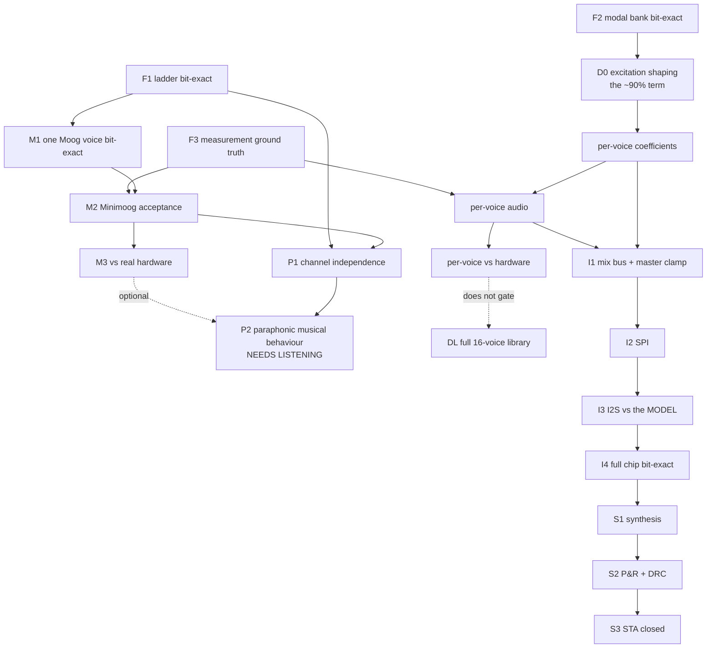

# The capability DAG

One capability at a time, stamped before the next — the way torchsynth was
built. But **not a ladder**: the 808's voices are independent of each other and
of the Moog, so the real structure is a directed graph, and the useful question
at any moment is "which nodes are unblocked right now".

## Why, specifically here

Every voice and every routing path multiplies the state space, so the cost of
establishing that a thing works grows faster than the thing itself. Two
measured facts from this repository:

- Every block is bit-exact against its model. **Two integration bugs still
  shipped** — a drum mix fault and a cowbell gating fault — both found by
  listening, not by any test.
- Six measurement claims here have been confidently wrong. One ("1,917 cells")
  was quoted three times before anyone noticed every output was X.

A stamped node is a place you can always return to, and a regression suite that
keeps running forever. Nodes are never un-stamped and their tests are never
deleted.

## What "stamped" means

All five, or it is not stamped. Four out of five is not a node.

1. **Tagged** — annotated git tag, `node/<id>`. Three exist:
   `node/F1-ladder`, `node/M1-voice`, `node/M2-minimoog`.
2. **A named test set, green, in CI on every push** — no path filter.
3. **Negative controls carried** — an injected defect that turns each property
   red. A test that has never failed is not evidence.
4. **Area measured**, labelled *cell* / *synthesized* / *routed*. Those are
   three different numbers and this repo has conflated them.
5. **A written statement of what the node does NOT cover.**

## The graph

## Foundation and Minimoog

| node | capability | status |
|---|---|---|
| F1 | Ladder filter, bit-exact | verifier green — stamping |
| F2 | Modal bank, bit-exact | on `drums`, PR #14 |
| F3 | Measurement library ground truth, 60 tests | **green on main** |
| M1 | One Moog voice, bit-exact, 255,060 frames | verifier green — stamping |
| M2 | Musically a Minimoog, 42 tests, 6 injected defects | **green on main** |
| M3 | Ladder structure vs real hardware | **BLOCKED** |

**M3 is blocked on one input, not on work.** `model/moog_probe.py` is built and
calibrated: the discriminator is **h5 relative to h3** (not h2 — `tanh` is
odd-symmetric, so h2 is absent in both our every-stage structure and the
one-tanh alternative, and a probe built on h2 would measure nothing). It
separates the two structures by 25 dB. But **0 of 222 Legowelt recordings
qualify** — 80 are odd-symmetric oscillator waveforms, 27 are near-sine but
carry even harmonics at or above their odd ones. It needs **one clip of a real
Minimoog filter self-oscillating**. Until then DR 0001 rests on circuit
derivation alone.

## Paraphony — and we have THREE oscillators, not four

| node | capability | status |
|---|---|---|
| P0 | A **fourth** oscillator exists | **not built** |
| P1 | The channels are genuinely independent | **untested** — issue #20 |
| P2 | Paraphony sounds right | **no automated criterion exists** |

**P0 is implementation work, not verification work, and this document
previously got it wrong.** `model/voice_fx.py:533` builds
`[OscFx(...) for _ in range(3)]`, and `sounding()` maps held keys to slots with
`[held[i] if i < len(held) else held[-1] for i in range(3)]` — so a fourth held
key is **never sounded**. What we have is *three*-note paraphony.

Three is the faithful Minimoog number (it has three VCOs), so this is not a
defect; it is a gap against the stated four-note target in issue #23.

`NV=4` is a different axis entirely: four **filter/channel contexts**, not four
oscillators. Conflating the two is what produced the earlier claim that
four-note paraphony merely needed testing. Four separately pitched oscillators
into one shared filter is the instrument we want — not four filters.

P1 is mechanical and can be done today. `rtl-sketch/tb_ladder_n.v:59-61`
assigns `x_in` *outside* the per-channel loop, so every channel receives
identical stimulus — a bug where channel 2 leaked into channel 3's state would
pass, because the channels would agree anyway. `synth_core` at `NV=4` routes
(1.079 mm², 0 DRC) and therefore looks finished. It is not.

**P2 cannot be automated and we should stop pretending otherwise.** Four notes
sharing one filter is a musical compromise, not a specification: whether it
sounds like an instrument or like a fault depends on voice allocation, note
stealing, and what the shared cutoff does to a held chord. There is no
reference recording, because the Minimoog is monophonic and never did this.
M1–M3 come first so that when P2 sounds wrong we know the voice itself is
right. The listening protocol P2 needs is not yet written.

## Drums, per voice

Shared first, but **D0 is a hypothesis to test on one voice, not a fix to
apply to all of them.** The discrimination study's classifier looks only at the
first 240 ms and finds most of its signal in the attack; that makes the attack
a promising target. It does **not** establish that the attack accounts for 90 %
of *audible* error — feature importance inside a 240 ms window is not
audibility, and two versions can both score 1.000 separable while one sounds
much better. An earlier draft of this document stated the stronger claim; it
was not supported.

What *is* supported: the fixes `docs/drum-verification.md` prescribes leave the
kit separated at 1.000, so they are not sufficient on their own; and the 808
acceptance suite independently finds the BD attack window simply absent (§2
wants ≈130 Hz for 4 ms). So: shape the excitation on **one** voice, compare
before and after by ear and by measurement, and extend it only where it helps.
It is an envelope change, so nearly free in area.

Each voice needs three things, deliberately separate so a failure localises:
**(a) coefficients** — read back and converted to (f0, τ) with no audio at all;
**(b) audio** — measured against a cited reference fact; **(c) hardware** —
against a real recording, where one exists.

| # | circuit | built | a. coef | b. audio | c. hardware | note |
|---|---|:-:|:-:|:-:|:-:|---|
| 1 | BD bass drum | ✓ | ✓ | **red** | 3.6 | no attack window; §2 wants ≈130 Hz for 4 ms |
| 2 | SD snare | ✓ | ✓ | ✓ | **3.4** | was 8.8; see the note under this table |
| 3 | **LC / LT** low conga *or* low tom | ✓ | ✓ | **red** | 7.1 | have LT; no pitch drop (§4) |
| 4 | **MC / MT** mid conga *or* mid tom | — | — | — | — | **missing** |
| 5 | **HC / HT** hi conga *or* hi tom | ✓ | ✓ | **red** | 6.0 | have HT; no pitch drop (§4) |
| 6 | **CL / RS** claves *or* rim shot | — | — | — | — | **missing**; one bridged-T |
| 7 | **MA / CP** maracas *or* hand clap | ✓ | ✓ | ✓ | n/a | have CP; no knob → no held-out setting |
| 8 | CB cowbell | ✓ | ✓ | ✓ | **red** | τ 26 ms vs a real 98 ms |
| 9 | CY cymbal | — | — | — | — | **missing**; shares the hats' six squares |
| 10 | OH open hat | ✓ | ✓ | ✓ | 6.9 | |
| 11 | CH closed hat | ✓ | ✓ | ✓ | n/a | no knob → no held-out setting |
| — | DL full library | — | — | — | — | simultaneity and mix, after all circuits |

**The 808's sixteen sounds are eleven or twelve circuits, in five exclusive
pairs.** (Roland's TR-08 pairing implies eleven; Wikipedia says twelve timbral
voices, plausibly over whether CH/OH is one shared circuit or two. Unresolved,
and it moves the arithmetic by one — see `docs/reduced-808-precedent.md`.) The
paired voices are the *same circuit retuned* and cannot sound simultaneously —
verified from Roland's own TR-08 instrument listing, which still groups them in
exactly those pairs thirty-five years later, and consistent with the original's
panel. This matters enormously for a shared modal bank, which needs a mode per
*concurrent* voice rather than per named sound.

**We have 8 of 11 circuits, so a complete 808 is +3 circuits, not +8 voices.
But +3 circuits is NOT +3 modes** — the eight-stop kit we already ship uses
**eleven active modes** (six filters, five bodies), because a single named
instrument can consume a band-pass, a high-pass and a body. Instrument names do
not map one-to-one onto resonators. Missing: the mid conga/tom, the claves/rim
shot, and the cymbal. Adding the second half of each pair we already own (LC,
MC, HC, CL or RS, MA) is a coefficient preset, not a mode.

**This has now been measured** — `docs/integration-area.md` section 3, from the
register image `kit_808()` actually writes and a parameter sweep of `modal_dp`
and `drum_kit` on gf180. Three corrections to what this section used to say:

1. **The filter half of the bank is already full.** `modal_dp` gives a
   numerator only to modes below `NUMS`, the kit runs at `NUMS = 6`, and its six
   filters are modes 0–5. The spare mode 11 sits above `NUMS`, so it can only
   ever be a RAW body. The bank is 6 of 6 filters with none to spare, not 11 of
   12 with one.
2. **+3 circuits is +4 to +7 modes**, not +3: the mid tom is +1 body, the
   claves/rim shot +1 body, and the cymbal +2 band-passes plus 2–3 high-passes
   (`docs/tr808-reference.md` §10). That takes the bank to 15–18 modes and
   `NUMS` to 8–11.
3. **The choice is 8, 16 or 32 modes — 12 is not a design point.** The bank's
   state arrays are padded by yosys to a power of two, so MODES 9 through 16
   cost *identically* (1,656 flops, ~605 k µm² of `drum_kit`). Twelve to sixteen
   is free; seventeen doubles the state and costs +189 k µm² (+31 %). The only
   marginal cost inside the bracket is configuration storage, ≈ 6,400 µm² per
   mode — **and none of that storage exists in RTL**, on any branch.

**Voice count is not our risk — the snare is.** No source in the survey
(`docs/reduced-808-precedent.md`) reports a reduced 808 rejected for having too
few voices; Roland's **T-8** ships six and reviewers call it *"authentically
reproduced"*. What gets rejected is one specific voice, and it is the snare
every time: the volca beats' is *"not snappy enough for a decent 808
emulation"* and users layer a clap over it, the T-8's *"loses the front end"*,
and io-808's author names his cymbal and rimshot.

**That matched our own measurement independently** — SD was our worst voice at
8.8 knob-equivalents, so the snare led the queue, ahead of D0. **It has since
been worked and is now 3.4**, below LT, OH and HT and just above the kick: the survey's own hazard
(an envelope into a VCA cutting a bridged-T short) was found on the one path
of that voice that really is one, and fixed, together with 11 dB of missing
upper partial (`docs/drum-verification.md` §8.6, contract revision 7). What
remains at 3.4 is not identified, and the classifier still separates the voice
at 0.938, so the verdict stays *known defect remains* — closer, not
indistinguishable. And the six square oscillators are not negotiable:
Mutable's **Peaks** kept all six phases on a 72 MHz part with two voices total
rather than fake them.

> **Dated 2026-09-18: the hardware column and the three `red` audio cells
> above are pre-revision-6 except where marked.** Re-running the full
> discrimination study on the merged kit (same corpus, same split hash, arm
> `ours`) gives **BD 2.5, SD 3.4, LT 6.7, OH 6.9, HT 7.2**, and the acceptance
> suite is green on the BD attack window, both tom pitch drops and the
> cowbell's τ = 98 ms — the three notes this table still carries as red. Only
> the SD row has been refreshed here, because that is the row this revision
> measured; the rest need whoever owns them to re-run rather than be edited
> from the side (`docs/drum-verification.md` §8, §8.6).

The hardware column is **knob-equivalent separation out of 10**: how far the
real machine's own knob must travel before it looks this different from itself.
It is not an accuracy. Three voices (CH, CP, CB) have no knob, so the corpus
cannot adjudicate them at all — the cowbell is documented wrong and
*unconfirmable* here. LT/HT/OH have only 2 held-out settings, below what
excludes chance. And there is **no real-vs-real floor** in this dataset.

Three of eleven circuits are missing, and the cymbal can share the hats' six
square oscillators (205.3/369.6/304.4/522.7/800/540 Hz) — but **only the
oscillators**, not the modes. The full library is **+3 circuits and +4 to +7
modes**. The "+5 to 7 modes" an earlier draft of this document guessed at from
the sixteen-sound count was therefore **very nearly right, and was discarded
for the wrong reason**: circuits and modes are different units, which is this
section's own point turned back on its own conclusion.

The decision this leaves is narrow and specific, and it is not about voice
count. Thirteen modes are spoken for before the cymbal is placed (eleven now,
plus the mid tom's body and the claves/rim shot's), so: **can the cymbal be
built in three bank modes — its two band-passes plus at most one high-pass?**
Three keeps a complete 808 inside the sixteen-mode bank the design already pays
for, for **+54 k µm²** all told, half of it configuration registers. Four or
more crosses the `MW = 5` cliff and costs **+228 k µm²**, four times as much.
That is a question about CY's three Sallen-Key high-passes, for whoever
implements CY — not one to settle from an area budget.

## What integration does NOT depend on

**A real-Minimoog recording (M3) and the complete drum library (DL) are not
prerequisites for integration.** An earlier draft of this graph routed both
into I1, which would have blocked the most valuable work in the repository on
an audio clip we do not have and on eight voices we have not built. Neither is
needed to establish that the instrument we already have works end to end.

They are genuine goals; they are not gates. The gates for integration are the
voice (M1, M2) and the drum coefficients and audio we already have.

## Integration and silicon

| node | capability | status |
|---|---|---|
| I1 | Mix bus and master clamp | |
| I2 | SPI control, including a write landing mid-sample | |
| I3 | I2S **compared against the model**, not the DUT | see below |
| I4 | Full chip bit-exact | first run came back **red** |
| S1 | Synthesis | **PLACEHOLDER DRUMS.** 925,387 µm² *synthesized cell*, 55.3 % utilisation on a **fixed** 1.7319 mm² die (so the utilisation is the measurement, not the die). **717,049 µm² with `DONT_USE_CELLS` empty** — allowing `*_1` drive strengths is −22.5 % area for +4.2 % critical path. `docs/integration-area.md` §1 |
| — | the drum swap | `synth_top.v:81` holds `drum_section_placeholder` (**158,770 µm²** cells) where `drum_kit` (**603,118 µm²**) belongs: **+444,348 µm², 3.8×**. Contract 17.23. The 89,004 µm² in `synth_top.v`'s header is the withdrawn `drum_src_seq` strawman, not the placeholder — `drum_dp` really measures 272,894, so that strawman was low by 3.1× |
| — | joined design | **PROJECTION, not a measurement** — nobody has synthesised a joined top. ~1.31 mm² of cells with `*_1` allowed (78 % of the slot's core), ~1.69 mm² without (**101 %** — does not fit). Allowing `*_1` is the difference between fitting and not. `docs/integration-area.md` §4.2 |
| S2 | P&R, DRC | running |
| — | FPGA | **routed on ECP5 25F**: 27 % logic, 12 % FF, 43 % DSP, **0 % BRAM**, Fmax 33.0 MHz post-route against a 12.288 MHz constraint. Does **not** fit iCE40 UP5K (163 % logic, 150 % DSP). `docs/fpga-build.md` |
| S3 | STA closed at every corner | |

I3 is called out because the existing top-level test compares the I2S stream
against the DUT's *own* sample stream, which is circular: it cannot detect a
bit-shift or a channel swap, which is exactly the bug that shipped broken in
trial1.

## Releases: each one a smaller instrument that already works

The DAG says what *depends* on what. It does not say what to ship. These are
the release gates, and the discipline belongs here rather than on every
exploratory task — an agent chasing a measurement does not need a milestone.

| release | what must work | gated on |
|---|---|---|
| **v0.1 known baseline** | The existing voice, its controls and its audio output reproduce from a clean checkout. **The actual note count is stated, not implied.** | F1, M1, M2 — all green |
| **v0.2 the voice through the whole path** | The existing voice reaching real audio out through the real control path: SPI in, mix bus, master clamp, I2S out, verified against the model | I1, I2, I3 |
| **v0.3 voice + the eight drums we have** | Real drums **connected to the top level**; solo hits and a combined groove; accent, choking and mixing correct | D-coef/audio, I4 |
| **v0.4 four-note behaviour** | A fourth oscillator, defined note allocation and retrigger, one shared filter, a verified per-sample cycle deadline | P0, P1, **after v0.3** |
| **v0.5 complete 808** | The missing circuits added **one family at a time**, every earlier check still green | the per-voice table |
| **v0.6 extensions** | Extra routing and experimental voices, each with an audible reason to exist | — |

Every release preserves **the exact source revision, the configuration, the
test results and a short audio demo**. FPGA, board and ASIC evidence are
recorded separately: a verified RTL version is worth having before a board
exists.

The immediate goal is **one reproducible version that is enjoyable to play**,
then small additions whose benefit can be heard and whose behaviour can be
verified.

## The rule, and where we stand against it

> **Do not start a node until its predecessors are stamped.**

We have been working on drums, integration and silicon with F1, M1, M2 and P1
all unstamped. There were **no git tags in this repository at all** until now,
and CI ran one of four suites — path-filtered so that an RTL change could not
turn it red.

**Stamped:** F1 (28,800 samples, 0 mismatches), M1 (255,060 frames, every tap
and the final state), M2 (42 tests, 6 injected defects).

**Unblocked right now, and being worked:** the SPI blocker (below), the snare
(#26), and an FPGA build.

**The fourth oscillator waits.** It is not first any more: there is little
point adding a voice while integration is changing the interfaces that voice
speaks through, and a trusted instrument is worth more than a wider one. It
lands at v0.4, on an instrument that already plays.

## The blocker

**The control path cannot express the drum register writes.** `spi_ctl.v:44`
declares `wr_addr [6:0]` — seven bits, maximum `0x7F` — and a 24-bit data
field. `drums_fx.py:85` uses `A_MODE = 0xC0` and `A_RESET = 0xFF`, so **every
modal-bank coefficient write and the reset are unaddressable**, and
`env_ctl` is 27 bits against 24.

Both sides are individually bit-exact against their models, which is precisely
why no existing test catches it. It is the same class as the two integration
bugs that shipped and were found by listening. Nothing downstream of I1 is real
until this is fixed.
