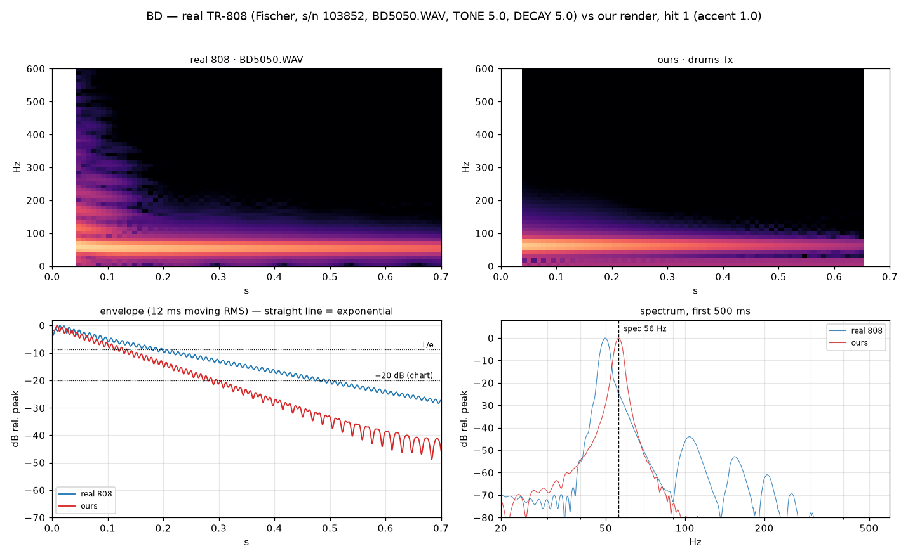
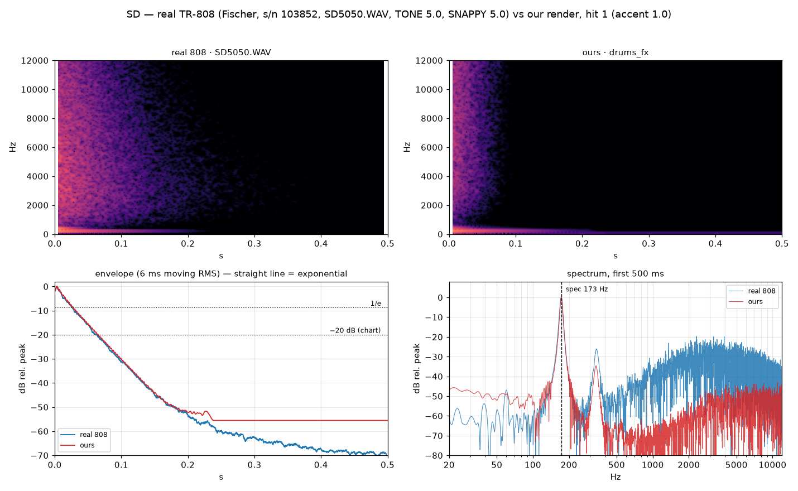
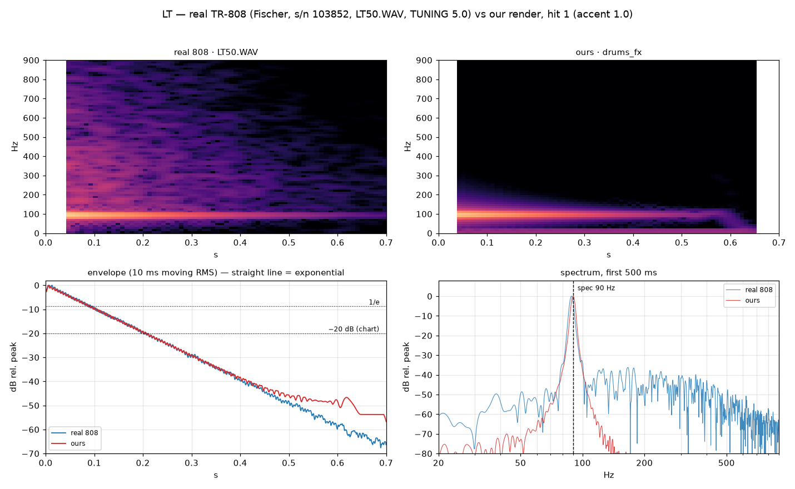
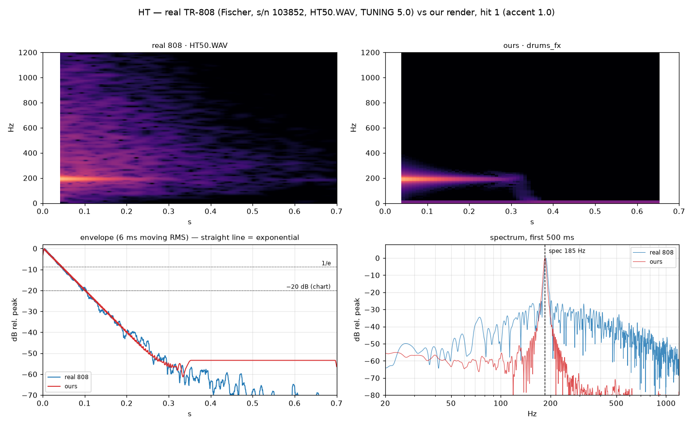
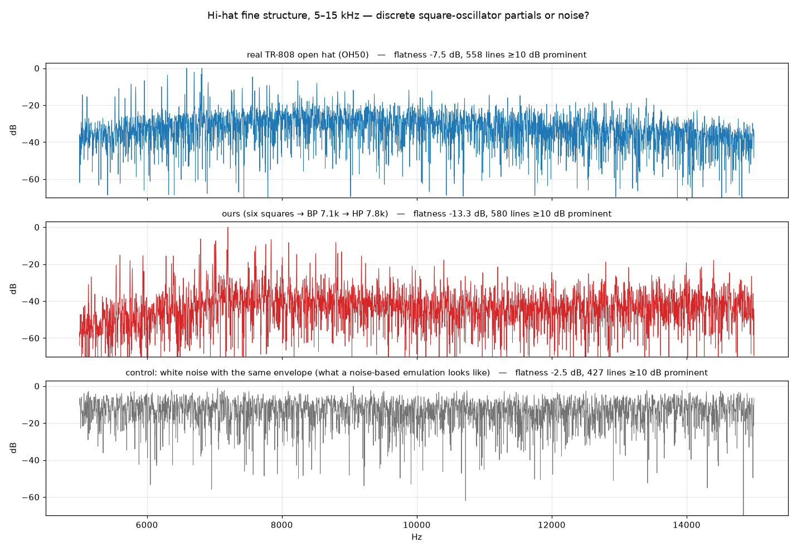
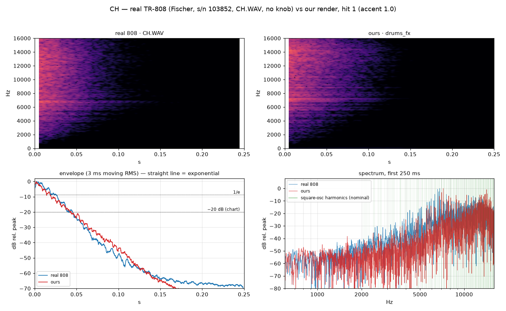
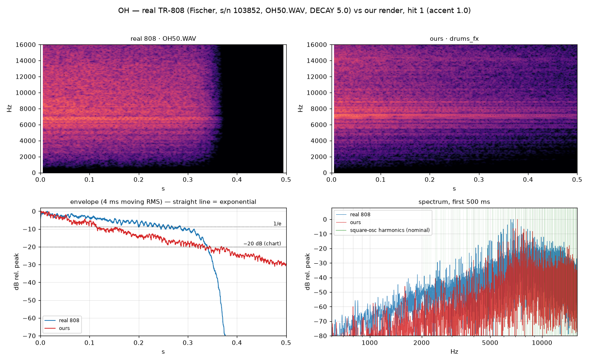
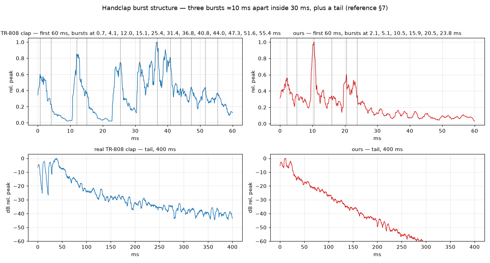
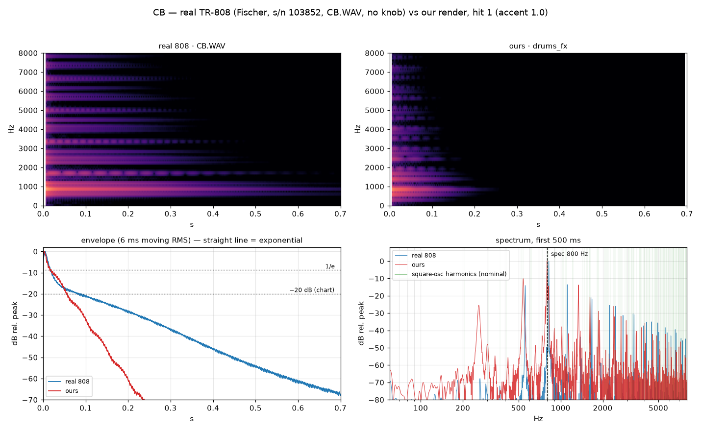

# Verifying the drum section against a real TR-808

What this is: every voice `model/drums_fx.py` renders, measured against a
recording of a real Roland TR-808 at the same panel setting, with the numbers
and the pictures behind each verdict.

> **Superseded in part, 2026-09-18 — read §8 first.** The body/air energy
> split used throughout §3 and §4 is invalid on a decaying one-shot and its
> numbers are withdrawn; so is "the first 4 ms peaks at 250 Hz". §8 gives the
> validated replacements and what was actually wrong. The structural findings
> — the cowbell's shared gate, the missing attack window, the snare's noise
> band — survive; the magnitudes do not.

**Headline.** Four of eight voices are right or nearly right. The snare is
badly wrong — ~~its noise is 16 dB too quiet~~ (withdrawn, §8.1: the level is
2.3 dB down, the *band* is the fault), so half the instrument is
missing. The cowbell is wrong in three ways. The bass drum works but is
thin, short and pitched high, which is the sponsor's "the kick is really
weak". **All four of the previously suspected defects are refuted**: they were
measurement artefacts, not design faults. The real faults are different ones,
listed below.

---

## 1. The reference audio

### Primary — Michael Fischer / Technopolis, CC0-1.0

| | |
|---|---|
| source | <https://github.com/tidalcycles/sounds-tr808-fischer> commit `85fbecf1bec32553395625ea659e2a56dfd7c0e1` |
| original | Michael Fischer / Technopolis, *"Roland TR-808 Rhythm Composer Sound Sample Set 1.0.0"*, 09/08/94 |
| licence | **CC0-1.0**, full legal code as `LICENSE` in the repo; each of the 16 `_soundmeta/*.json` independently declares `"license": "cc0"`. Public-domain dedication — redistribution permitted |
| machine | a real Roland TR-808, **serial no. 103852**, explicitly *not* samples of samples |
| capture | the **individual voice outputs**, not the master bus; 16-bit / 44.1 kHz, SoundEdit 16 on a Quadra 660AV |
| contents | 116 one-shots, one file per voice per knob position, all 16 voices |

The reason this set and not another: **every knob position is in the
filename**, on a 0–10 scale sampled at 0.0 / 2.5 / 5.0 / 7.5 / 10.0, tone or
tuning before decay or snappy. `BD5050.WAV` is the bass drum with TONE 5.0 and
DECAY 5.0 — which is exactly the "all knobs at 12 o'clock" condition of
Roland's own June-1981 tuning chart (`tr808-reference.md` §1.6), the chart
every preset in `kit_808()` is derived from. So the comparison is like for
like rather than against an unlabelled sample somebody normalised.

Two caveats the set states about itself, both honoured here:

- **LEVEL was pinned at maximum for every voice.** The relative loudness
  between voices in this set is not the machine's. Nothing below compares
  loudness across voices; every file is peak-normalised before measurement.
- The audio is CC0; "Roland" and "TR-808" remain Roland's trademarks.

Not committed to this repo — it is 12 MB of audio and `.gitignore` excludes
`*.wav`. Fetch it with the clone above; the script takes its path.

### Cross-check — Apple Logic Pro, "Boutique 808"

`/Library/Application Support/Logic/Ultrabeat Samples/Boutique 808/`,
26 uncompressed AIFFs (`GB_Tasty808_*`). Apple factory content: licensed for
use in the user's productions, **not redistributable**, so it is a private
cross-check only. Used to confirm the Fischer set is not idiosyncratic. It
agrees on every structural number: snare 176 Hz, rimshot 455 Hz, claves
2542 Hz, cowbell 856 Hz, and hats/cymbal all peaking at 7141–7173 Hz — the
7.1 kHz band-pass. Its provenance and processing are undocumented, so no
verdict here rests on it.

### Also on this machine, and unusable

`~/Music/Ableton/Factory Packs/Drum Machines/` has a complete 808 kit, one
file per voice, but every file is Ableton's proprietary compressed AIFF-C
(`FORM…AIFC…able`). Neither ffmpeg nor scipy decodes it. Noted so nobody
repeats the search.

### Candidates rejected

- **kb6.de** — the Roland content has been deleted from the site ("*13,049
  WAV samples … have been deleted from this list*"), and it carried no
  explicit licence anyway.
- **archive.org `tr-808-samples`** — excellent provenance (early-revision
  unit, RME UFX) but **no licence metadata**, and two long continuous FLACs
  rather than per-voice one-shots.
- **archive.org `808-for-cmi`** — no licence metadata.

---

## 2. How the measurements are taken

`model/drum_verify.py`. Run:

```sh
git clone https://github.com/tidalcycles/sounds-tr808-fischer /tmp/tr808-fischer
.venv/bin/python model/drum_verify.py \
    --refs /tmp/tr808-fischer \
    --ours <dir holding 00-solo-N-XX.wav> \
    --out docs/img/drum-verification
```

Four rules, because the obvious version of each is wrong:

1. **Each solo render holds three hits** (0.05 s at accent 1.0, 0.75 s at
   1.4, 1.45 s at 0.6). They are segmented and measured individually. The
   earlier report of a 700 ms attack on seven voices came from measuring
   first-onset to *global* peak across a whole file, which finds the second
   hit.
2. **Decay is a least-squares fit** of the log-envelope over −3 dB to −30 dB,
   reported with its R² and the dB span it covers, plus t(−20 dB) which is
   what Roland's chart column is comparable to. A first crossing of 1/e is
   useless here: the hats and the cowbell are sums of incommensurate squares
   whose envelope beats by 6–10 dB, and the first crossing reads a trough.
   This is what produced "BD decays in 3.4 ms".
3. **The envelope is a moving RMS** over several periods of the voice's own
   fundamental (12 ms for a 50 Hz kick, 3 ms for a hat), for the same reason.
4. **Nothing is resampled.** The references are 44.1 kHz and our renders
   48 kHz; every metric here is rate-independent.

Two numbers are reported for brightness, because one of them lies. The
**magnitude centroid** is the textbook definition and is what the earlier
report used — but it weights a wide, quiet noise floor heavily, so a voice
with 98 % of its energy below 700 Hz can still show a 6.5 kHz magnitude
centroid. The **power centroid** and the **body/air energy split** are
reported alongside and are the ones that track what you hear.

---

## 3. The four suspected defects — all four refuted

| # | reported | measured | verdict |
|---|---|---|---|
| 1 | BD decays in 3.4 ms against a spec of 15–540 ms | **τ = 127.4 ms**, R² 0.991 over a 27 dB span, and 127.4 / 127.4 / 128.0 ms on the three accents | **refuted.** The decay reaches the modal coefficients fine. A separate, real BD problem is in §4.1 |
| 2 | LT decays in 2.2 ms against 92 ms | **τ = 88.8 ms** against a spec of 88 and a real machine measuring **87.6 ms** | **refuted.** LT is one of the two best voices we have |
| 3 | CP centroid 4552 Hz against a 1070 Hz band-pass — band-pass not in the path, tail VCA missing | spectral peak **1050.5 Hz** against the real machine's **999.5 Hz**; tail present, τ 36.9 ms against the real 37.4 ms | **refuted, and the test was invalid.** A 2-pole band-pass at Q 1.6 has 6 dB/oct skirts, so white noise through it has a magnitude centroid of several kHz by construction. **The real TR-808 clap measures 3601 Hz.** Comparing a centroid against a band-pass centre is a category error |
| 4 | OH centroid 11019 Hz, +41 % — getting CH's 11.7 kHz corner | OH **10386 Hz** against the real machine's **9769 Hz**, i.e. **+6.3 %**. Our CH is 12387 Hz — 2 kHz above our OH | **refuted.** Energy above 13 kHz: our CH 47.0 %, our OH 5.5 %. If OH used CH's corner these would match; they differ by 8.5× |

None of the four was a design fault. Three of the four were artefacts of how
the measurement was taken; the fourth compared a statistic against a number
that statistic cannot equal.

---

## 4. Per-voice verdicts

Every row: real = Fischer s/n 103852 at the stated knobs, ours = hit 1 of the
solo render at accent 1.0.

| voice | verdict | f0 / peak | τ | worst single error |
|---|---|---|---|---|
| **BD** | **close — thin and short** (§8.3) | 56.0 vs **49.8** Hz — superseded, 50.70 ± 0.02 | 127 vs 230 ms — superseded, the kit's own f0 error (DR 0009) | no attack transient, no harmonics |
| **SD** | **wrong** (§8.1) | 173.0 vs 172.0 Hz ✓ | 29.1 vs 28.4 ms ✓ | ~~noise 1.2 % vs 47.3 %~~ withdrawn — 18.6 % vs 27.7 %, and the band is wrong |
| **LT** | **matches** | 90.0 vs 88.4 Hz (+1.8 %) | 88.8 vs 87.6 ms (+1.4 %) | pink noise absent (small) |
| **HT** | **matches** | 185.0 vs 187.5 Hz (−1.3 %) | 43.0 vs 41.7 ms (+3.1 %) | pink noise absent (small) |
| **CH** | **close — too bright** | 7200 vs 6814 Hz | 19.6 vs 16.0 ms (+23 %) | 47 % above 13 kHz vs 30 % |
| **OH** | **close — too narrow** | 7200 vs 6814 Hz | 158 vs 180 ms (−12 %) | 84 % in 6–9 kHz vs 67 % |
| **CP** | **close — flam smeared** | 1050 vs 999 Hz (+5.1 %) | 37.0 vs 37.4 ms ✓ | bursts sit on a plateau, not gaps |
| **CB** | **wrong** | 800 vs 823.6 Hz ✓ | 30.0 vs **98.0** ms | difference tone at 260 Hz that the machine has not got |

---

### 4.1 BD — close, and it really is weak



What is right: both envelopes are clean exponentials over 27 dB (R² 0.991
ours, 0.996 the machine). The **decay-knob range in §12 is
confirmed exactly** — the real machine sweeps τ from **15.2 ms** at DECAY 0.0
to **532 ms** at DECAY 10.0, against the document's "15 → 540 ms". Pitch does
not move with the decay knob (49.6 → 50.6 Hz across the whole range), which is
the reference's central claim about the bridged-T with feedback, confirmed on
hardware. Our τ is stable to 0.5 % across accents.

Three things are wrong, and together they are "the kick is really weak":

1. **Pitch is 12.4 % high.** Ours 56.0 Hz, the real machine 49.8 Hz, and
   49.6–50.6 Hz on all 25 of its bass-drum files. 56 Hz comes from Roland's
   chart ("18 ms period"); the hardware says 50. That is nearly two
   semitones, and the 808 kick is a pitch people know.
   **Fix:** `mode_writes(M_BD, 50.0, ...)` in `kit_808()`.
2. **Decay is 45 % short.** Ours τ = 127 ms; the real machine at the same
   12-o'clock DECAY is 230 ms, t(−20 dB) 459 ms against our 263 ms. Our
   preset sits at about knob 4.2 of 10. The ends of the range are right, so
   this is the mid-point mapping, not the mechanism.
   **Fix:** Q ≈ 40 rather than 22.3 (τ ∝ Q).
3. **There is no attack and no harmonic structure.** ~~The real bass drum's
   first 4 ms has its energy at **250 Hz**~~ — **withdrawn, an FFT-bin
   artefact; see §8.3 for the band-energy measurement that replaces it**; ours has no spectral peak above DC
   at all — the first 4 ms is a rising ramp. And the real one has a 2nd
   harmonic at **−43 dB** and a 3rd at −51 dB, where ours are at **−80 and
   −97 dB**: ours is a mathematically pure sine. On anything smaller than a
   subwoofer the harmonics *are* the kick. This is the largest contributor to
   "weak".
   **Fix:** the §14 "BD attack window" preset (130 Hz for 4 ms) is specified
   but is not in `kit_808()` — only `E_BDCLICK`, a 1 ms pulse leak at peak
   0.06, which produces a click with no pitch. Switch the attack preset in,
   and add a little asymmetric saturation on the body path to generate h2/h3.

Note also the real attack takes **14.0 ms** to peak against our **8.8 ms**
(and on a 4 ms envelope window, 17.4 against 4.5 — the measurement is
window-sensitive, so take the ratio, not the absolute). A two-pole resonator
struck by an impulse peaks in a quarter period, which at 56 Hz is 4.5 ms; the
real 808's excitation is not an impulse but a pulse shaped over ~10 ms, and
that is why its energy arrives as body rather than as a click.

### 4.2 SD — wrong. Half the instrument is missing



Look at the envelope panel: the two traces are superimposable. The tonal half
of this voice is excellent —

| | ours | real | spec |
|---|---|---|---|
| low mode | 173.0 Hz | 172.0 Hz | 173 |
| high mode | 336.1 Hz | 339.4 Hz | 336 |
| τ | 29.1 ms | 28.4 ms | 30 |
| t(−20 dB) | 62.3 ms | 57.7 ms | 60 |

The "later units, ≈173/336 Hz" branch of §3 is **confirmed on hardware**: this
machine measures 172.0 Hz on all 25 snare files. The 1981 chart's 238/476 Hz
is not what a 1980s-serial unit does.

Now the spectrum panel. The real machine's noise band sits at −20 dB from
1.5 to 10 kHz. Ours sits at −50 dB. Measured as energy:

> **This table is withdrawn (§8.1).** Both columns are the whole-span Hann
> split, which under-reports a fast-decaying noise by 5–9×. The validated
> figures are 27.7 % for the machine at SNAPPY 5.0 and 18.6 % for ours.

| | body (<700 Hz) | noise (>700 Hz) | power centroid |
|---|---|---|---|
| real, SNAPPY 5.0 | 48.5 % | **51.5 %** | **2513 Hz** |
| ours | 98.8 % | **1.2 %** | **282 Hz** |

~~The noise is **about 16 dB too quiet**~~ — a factor of 47 in power. Measured
against the machine's own SNAPPY law, our kit is sitting at roughly **2.5 on a
0–10 dial** while claiming to be the 12-o'clock reference:

| SNAPPY | 0.0 | 2.5 | 5.0 | 7.5 | 10.0 |
|---|---|---|---|---|---|
| noise share, real | 0.0 % | 1.1 % | 47.3 % | 79.3 % | 89.8 % |
| ours | | **1.2 %** | | | |

> Withdrawn (§8.1). The validated curve is 4.70 / 4.96 / 27.66 / 56.01 /
> 71.89 %, it is flat from 0 to 2.5, and ours interpolates to SNAPPY ≈ 4.4.

Second, the band is wrong. Ours is white noise through a 2-pole high-pass at
2.75 kHz, so it is flat to Nyquist. The real machine's snare noise is a hump:

| Hz | 0.7–1.5 k | 1.5–3 k | 3–5 k | 5–8 k | 8–12 k | 12–20 k |
|---|---|---|---|---|---|---|
| real | 2.0 % | 20.3 % | **34.9 %** | 28.3 % | 10.7 % | 3.8 % |

It peaks at 3–5 kHz and falls above. §3's "2-pole HP 2.75 kHz Q 0.7" is
therefore **incomplete** — something band-limits the noise above ~5 kHz that
the SD schematic walk-through does not account for. `tr808-reference.md` §3
should be amended.

**Fix:** raise `E_SDN`'s peak and `M_SDHP`'s amp until the noise carries
~50 % of the energy at accent 1.0, and add a low-pass (or a band-pass around
4 kHz) to the snappy path. Until then this does not sound like an 808 snare;
it sounds like a tuned tom.

### 4.3 LT and HT — match




The best two voices. The reference document's tom table is confirmed almost
exactly by the hardware, across the whole tuning knob:

| knob | 0.0 | 2.5 | 5.0 | 7.5 | 10.0 | §12 says | τ real | τ §12 | τ ours |
|---|---|---|---|---|---|---|---|---|---|
| LT | 81.4 | 83.7 | **88.4** | 93.1 | 99.3 | 80 / 90 / 100 | 87.6 ms | 92 | **88.8** |
| MT | 124.6 | 128.0 | **135.1** | 144.1 | 153.8 | 120 / 135 / 160 | 57.8 ms | 58 | — |
| HT | 170.4 | 176.2 | **187.5** | 201.3 | 212.2 | 165 / 185 / 220 | 41.7 ms | 44 | **43.0** |

Ours lands inside 2 % on pitch and 5 % on decay for both. Nothing to do here.

One gap, small but real: **the toms have no noise path.** §4 specifies pink
noise through a 1-pole low-pass at 400 Hz; `kit_808()` routes only
`SRC_PULSE` to `M_LT` and `M_HT`. Measured, the real machine has 0.04 % (LT)
and 0.14 % (HT) of its energy above the split frequency and ours has 0.00 %.
That is −28 dB on HT — small in energy, but it is the entire "air" of the
attack. Worth adding; not worth blocking on.

Attack is again fast: 5.6 ms against the real 12.9 ms (LT), 4.0 against 4.9
(HT). Same cause as the BD — we strike with an impulse where the machine uses
a shaped pulse.

### 4.4 CH and OH — close; the hats are genuinely square-oscillator hats



This is the diagnostic that matters most, and **we pass it**.

| | flatness, 5–15 kHz | lines ≥10 dB prominent |
|---|---|---|
| real TR-808 open hat | **−7.5 dB** | 558 |
| ours | **−13.3 dB** | 580 |
| white noise, same envelope (control) | −2.5 dB | 427 |

The real machine's hat is discrete, not broadband — which settles hypothesis 2
of §13 empirically rather than from the schematic. Ours is discrete too, and
on the same grid: both our render and a synthetic six-square control put lines
at 6283 and 6795 Hz, and the real machine has strong lines within a few Hz of
both. No noise-based emulation reaches −7.5 dB, let alone −13.3.

We are also *more* discrete than the machine (−13.3 vs −7.5 dB). The
difference is the floor between the lines: the real unit's sits at about
−35 dB, ours at −45 dB. That floor is oscillator jitter plus the avalanche
noise generator bleeding across the board, and it is part of the sound — a
hat with nothing between the partials reads as "cleaner than an 808", which
for this instrument is not a compliment. Worth a small dither on the
oscillator increments if it is cheap.




The two high-passes are distinct and in the right order — this is the
refutation of suspected defect 4:

| energy | 3–6 k | 6–9 k | 9–13 k | >13 k | magnitude centroid |
|---|---|---|---|---|---|
| real CH | 3.8 % | 30.1 % | 36.1 % | 30.0 % | 11734 Hz |
| ours CH | 1.1 % | 22.0 % | 29.8 % | **47.0 %** | 12387 Hz |
| real OH | 8.7 % | 66.9 % | 20.2 % | 4.2 % | 9769 Hz |
| ours OH | 3.3 % | **83.8 %** | 7.4 % | 5.5 % | 10386 Hz |

Both are about 6 % bright. The shape errors are in opposite directions and
are the same error: **our filters are too selective.** Our CH dumps 47 % of
its energy above 13 kHz where the machine puts 30 %; our OH crams 84 % into
6–9 kHz where the machine spreads 67 %. Both of ours have roughly a third of
the machine's 3–6 kHz spill. The real 2-pole high-passes leak more below
corner than ours do, and the real machine rolls off above 13 kHz where ours
does not.

Decay: CH τ 19.6 ms against the real 16.0 (spec 22); t(−20 dB) 40.8 against
37.1 — good. OH τ 158 against 180 (spec 196), −12 %. The machine's OH DECAY
knob runs 22 → 63 → 180 → 217 → 214 ms; note it **saturates above 7.5**,
which our linear decay control does not reproduce and probably should.

One unverified oddity: our CH's dominant partial is 7200 Hz at accent 1.0 but
14221 Hz at accent 1.4 and 14400 Hz at accent 0.6 — an octave jump, with
level. All three are harmonics of the same 800 Hz oscillator (the 9th and the
18th), so it is the swing VCA's saturation changing which line wins. The reference set has only one closed-hat sample, so **we cannot
tell whether the real machine does this.** Flagged, not judged.

### 4.5 CP — close; the flam is smeared



The structure is there. §7's burst hypothesis is confirmed on hardware: the
real clap has three clean bursts with the envelope falling to **0.02** between
them, at **0.7, 12.0 and 25.4 ms** — period ≈12.3 ms, the group spanning
~31 ms — and then a tail. Tail decay τ 37.4 ms real against our 36.9 ms;
§12's τ ≈ 47 ms is a little long but the right order.

Two defects:

1. **Burst period is 9.5 ms where the machine's is 12.3 ms** — about 25 %
   fast. `kit_808()` uses `period=480` frames at 48 kHz = 10.0 ms; ≈590 would
   match. §7's "≈10–12 ms" should be tightened to ≈12 ms.
2. **The tail has no attack, so the bursts do not stand clear.** Our envelope
   falls only to **0.25** between bursts; the real one falls to **0.02**. The
   real machine's tail *rises* — its overall peak is at 37 ms, after the
   third burst — whereas `E_CPTAIL` fires at full level at t = 0 and only
   decays, laying a plateau under the burst train. The gaps are the flam.
   Without them this is a buzz, and the clap is one of the three voices that
   say "808" (§16).
   **Fix:** give the tail envelope an attack, or charge it from the burst
   train rather than from the trigger.

Band-pass placement is fine: peak 1050 Hz against the real 999 Hz, power
centroid 1848 against 1612, body/air split 76.7/23.3 against 82.9/17.2.

### 4.6 CB — wrong in three ways, and the reference document's open item is now closed



Pitch is right: our 800.0 Hz against the machine's 823.6 Hz, and the machine's
second oscillator at 558 Hz against our 540 Hz. Both of those are the
**factory-trimmed** pair (TM1/TM2), so +2.9 % and +3.3 % is this unit's trim,
not our error. §13's hypothesis 3 — the cowbell is oscillators 5 and 6 — is
confirmed: every partial in the real cowbell is a harmonic of 558 or 824 Hz.

**(a) The tail is 3× too short.** The envelope panel is unambiguous. Fitted
over −3…−30 dB the real cowbell's τ is **98.0 ms** against our **30.0 ms**,
and its slow slope rings on past 700 ms where ours is dead at 240 ms
(t(−20 dB) 76.0 ms against our 50.9 ms). `E_CBB`'s 30 ms should be ≈100 ms.
An 808 cowbell that stops in a quarter of a second is not the sound.

**(b) The band-pass is in the wrong place — and we can now say where it
belongs.** §9 says of the cowbell filter: *"Treat the centre frequency as a
parameter to fit against a recording."* Fitting a 2-pole band-pass to 16
identified partials of the real cowbell, with the square's duty cycle and the
two gates' relative level free:

> **fc = 1100 Hz, Q = 2.8**, duty 0.452, the 558 Hz gate 1.9 dB below the
> 824 Hz gate — rms residual **2.8 dB** over 16 partials, worst 5.7 dB.

We ship 900 Hz Q 4.0. The consequence is measurable: our magnitude centroid is
1881 Hz against the machine's 2190 Hz, **−14 %**. This also settles two
loose ends in §9: the document's own inference of "0.9 kHz, Q 4–5, putting
540 Hz ≈15 dB down" is nearly right on the *level* (measured: 558 Hz sits
14.7 dB below 824 Hz) but the centre is ~200 Hz low and the Q too high; and
SOS-CB's "band-pass centred at 2.64 kHz" is **refuted** — 2.64 kHz fits the
data far worse than 1.1 kHz.

**(c) We generate intermodulation products the machine cannot.** Our spectrum
has a line at **260 Hz at −26 dB** and another at **1340 Hz at −14 dB**. These
are 800 − 540 and 800 + 540: difference and sum tones. The real machine is
**below −70 dB at 260 Hz** — a 44 dB discrepancy — and has nothing at
1340 Hz; its −14 dB line is at 1117 Hz, which is 2 × 558, a genuine harmonic.

The cause is structural. §9: *"Each oscillator has its own transistor gate
(Q15, Q14, 'exclusive gate (VCA)')"* — the machine gates the two squares
**separately** and mixes them afterwards, so they never multiply. `kit_808()`
routes `SRC_SQPAIR` (the *sum* of oscillators 5 and 6) through one
`NL_SWING` nonlinearity, which multiplies them. **Fix:** two paths, one per
oscillator, each with its own swing VCA, summed into `M_CBBP`.

---

## 5. Where we are better than the reference

The reference is one 40-year-old machine recorded in 1994, and some of what it
does is age and converters rather than design.

- **Reproducibility.** Our τ varies by less than 0.5 % across the three
  accents on every voice (BD 127.4 / 127.4 / 128.0 ms). The real machine's
  BD τ at a fixed DECAY 5.0 measures 138–230 ms across its five TONE files —
  knob positions that cannot affect decay. That is drift, and we do not have
  it.
- **Dynamic range.** Our BD envelope is a straight line to −70 dB. The
  reference recording floors out at −68 dB, and the clap recording at −40 dB,
  so the real tails are partly buried in 1994 converter noise. Our clap tail
  is clean 20 dB further down.
- **Snare mode stability.** Our two modes sit at 173.0 and 336.1 Hz on every
  hit. On the real machine `SD0010` reads its upper mode at 569 Hz instead of
  339 — a level-dependent shift in the second resonator we do not reproduce
  and should not want to.

The hats' flatness (§4.4) is the one place where "purer than the machine" is
probably a defect rather than a virtue.

---

## 6. What to change, in order

> **Status after contract revision 6 (§8):** 1 done (but the diagnosis was
> wrong — the level was 2.3 dB down, not 16 dB, and the band was the fault);
> 2 done, all three parts; 3 done for f0 and the attack window — the decay
> needed no change and the h2/h3 gap is the excitation shape, 17.20; 4, 5 and
> 6 not done. The priority order below is also superseded: a discrimination
> study over the whole kit puts the snare furthest from the machine and the
> bass drum closest, and puts **the excitation shape** above everything in
> this table.

| | voice | change | why |
|---|---|---|---|
| 1 | SD | raise `E_SDN` peak / `M_SDHP` amp by ≈16 dB; band-limit the snappy path around 4 kHz | half the instrument is missing; worst defect found |
| 2 | CB | `E_CBB` 30 ms → ≈100 ms; band-pass 900 Hz Q 4 → **1100 Hz Q 2.8**; split `SRC_SQPAIR` into two separately-gated paths | tail 3× short, centroid −14 %, 260 Hz tone the machine has not got |
| 3 | BD | f0 56 → **50 Hz**; Q 22.3 → ≈40; switch in the §14 attack preset; add h2/h3 | this is "the kick is really weak" |
| 4 | CP | burst period 480 → ≈590 frames; give `E_CPTAIL` an attack | the flam is the clap |
| 5 | CH/OH | broaden both high-passes; roll off our CH above 13 kHz | both ≈6 % bright, both too selective |
| 6 | LT/HT | add the pink-noise path (§4) | −28 dB of missing air; cosmetic next to the above |

## 7. Amendments this measurement suggests for `tr808-reference.md`

- **§2** — BD f0: the hardware says **49.6–50.6 Hz** across all 25 files and
  all knob positions. The "49–56" range is right but 56 is the chart's number,
  not a measurement; 50 is. The decay range "15 → 540 ms" is **confirmed
  exactly** (measured 15.2 → 532 ms). The BD's first 4 ms peaks at **250 Hz**,
  not the stated ≈130 Hz.
- **§3** — the snare's noise path needs a **low-pass or band-pass around
  4 kHz**; "2-pole HP 2.75 kHz Q 0.7" alone predicts energy flat to Nyquist
  and the machine measures a hump peaking at 3–5 kHz. The 173/336 Hz "later
  units" branch is **confirmed** (172.0 Hz measured).
- **§4** — the tom table is confirmed across the whole tuning range; no change.
- **§7** — the clap's burst period is **≈12.3 ms**, not "≈10–12 ms", and the
  tail envelope **rises** (peaks ~37 ms, after the third burst) rather than
  firing at full level.
- **§9 / §18** — the cowbell band-pass open item can be closed:
  **fc ≈ 1100 Hz, Q ≈ 2.8** by fit to a recording, 2.8 dB rms over 16
  partials. SOS-CB's 2.64 kHz is refuted.
- **§11** — the OH DECAY knob **saturates** above 7.5 (180 → 217 → 214 ms).
- **§13** — hypotheses 2, 3 and 4 are now confirmed by measurement of a real
  unit, not only from the schematic.

---

*Measured 2026-09-18 against `sounds-tr808-fischer` @ `85fbecf`, renders from
`model/drums_fx.py` as of the `drums` branch. Script:
`model/drum_verify.py`. Plots: `docs/img/drum-verification/`.*

---

## 8. Re-measured, 2026-09-18: one method withdrawn, three faults fixed

Everything above this section was measured with `model/drum_verify.py`. Four
of its findings do not survive re-measurement, and **the headline of §4.2 is
one of them**:

| | why |
|---|---|
| "the snare's noise is 16 dB too quiet" (§4.2) | the body/air split is invalid on a decaying one-shot (§8.0); the gap is 2.3 dB and the *band* is the fault (§8.1) |
| "the real bass drum's first 4 ms has its energy at 250 Hz" (§4.1) | an FFT-bin artefact; 4 ms at 44.1 kHz gives 250.6 Hz bins (§8.3) |
| "the BD decay is 45 % short" (§4.1) | not a decay fault: the kit's own f0 error propagating through τ = Q/(π f0) (§8.3) |
| "BD pitch, ours 56.0 vs real 49.8 Hz" (§4) | the direction is right, the number superseded — 50.70 ± 0.02 at the 12-o'clock condition (§8.3) |

The structural findings survive: the cowbell's shared gate, the snare's noise
band, the missing attack window. This section supersedes the rows it names;
the rest of the document stands. New measurements are `model/drum_fit.py`,
validated in `model/test_drum_fit.py`.

### 8.0 The method that failed, and how it was caught

`drum_verify.measure`'s **body/air energy split** — power above and below a
split frequency, from `drum_verify.spectrum` — applies a Hann window across
the whole analysis span. On a 500 ms span that weights t = 10 ms by **0.0039**
and t = 250 ms by **1.0**: a 48 dB tilt away from the attack and towards
whichever component decays slowest. On a decaying one-shot it therefore does
not measure energy; it measures the tail.

Caught by building the one case where the truth is exact. The snare's tonal
path and its noise path are separate paths into separate modes with linear
nonlinearities, so each renders alone and the two sum to the whole, and the
true noise share is arithmetic:

| our SD render, noise share | |
|---|---|
| **truth**, from the two separate renders | **18.55 %** |
| damped-mode subtraction (`drum_fit.noise_share`) | 18.90 % |
| the committed body/air split at 700 Hz | **1.25 %** |

The split is wrong by a factor of 15. On synthetic mixtures with a share set
by construction it under-reports by 5–9× whenever the noise decays faster than
the tone, which is exactly our snare's case. Both facts are now tests that
must keep failing for the old method
(`test_the_whole_span_hann_split_is_the_artefact_it_is_recorded_as`).

**The separator that replaces it** fits one damped sinusoid per body mode —
amplitude, frequency, τ and phase free, τ ≥ 5 ms so the shaped pulse cannot be
mistaken for a mode — and calls the residual noise, over a **stated 250 ms
window from onset**. Validated twice: against synthetic mixtures across
0–90 % (within 0.6 pp below a 30 % share, 1.5 pp above), and against the exact
share of our own render (18.90 % against 18.55 %).

This is the **fifth** measurement artefact in this voice's history, after the
four of §3, and the third of the same family: a window or a transform chosen
without checking what it does to a signal that decays.

### 8.1 SD — the noise level was never 16 dB down; the *shape* was the fault

**Withdrawn**: "noise 1.2 % of energy vs 47.3 %", "about 16 dB too quiet",
"our kit is sitting at roughly 2.5 on a 0–10 dial", and the §4.2 body/noise
table. All are the whole-span split.

The SNAPPY knob's transfer curve, from all 25 snare files, mean over the five
TONE positions, by damped-mode subtraction:

| SNAPPY | 0.0 | 2.5 | 5.0 | 7.5 | 10.0 |
|---|---:|---:|---:|---:|---:|
| noise share | 4.70 % | 4.96 % | **27.66 %** | 56.01 % | 71.89 % |
| noise/tone amplitude | 0.212 | 0.219 | **0.619** | 1.153 | 1.652 |
| dB | −13.5 | −13.2 | **−4.2** | +1.2 | +4.4 |

The curve is **flat from 0 to 2.5** — the pot's dead zone plus the separator's
own ≈4.7 % floor on this material — so a share below about 8 % cannot be
placed on the knob at all, and "ours sits at 2.5" was never readable from one
file. Ours measured a noise/tone amplitude of **0.477**, which interpolates to
**SNAPPY ≈ 4.4**, and the gap to the 12-o'clock setting the kit claims is
**2.3 dB**, not 16.

What *is* badly wrong is the band. The machine's snare noise, recovered as the
residual, against ours:

| % of noise energy | 0.7–1.5 k | 1.5–3 k | 3–5 k | 5–8 k | 8–12 k | 12–16 k |
|---|---:|---:|---:|---:|---:|---:|
| reference unit | 1.6 | 20.5 | **36.1** | 28.5 | 10.4 | 2.9 |
| ours (rev 5) | 0.1 | 2.6 | 15.7 | 22.8 | **30.2** | **28.6** |

**The shaping fix is one register** — the numerator. The level is the separate
SNAPPY setting above, and the three SD mode `amp`s are rebalanced with it so
the voice still peaks at its chart proportion.
`tr808-reference.md` §3 gives the snappy filter
as "2-pole HP 2.75 kHz Q 0.7". Keep that pole exactly and read it as a
**band-pass** instead of a high-pass and it fits the measured noise spectrum
to **1.9 dB weighted rms** against the high-pass's **5.2 dB** — as well as the
best unconstrained single mode (2938 Hz Q 0.75, 1.90 dB) and within 0.1 dB of
a two-mode cascade that would cost a spare mode and a path. So §3's numbers
were right and only the numerator was wrong; contract 17.22 records that the
schematic reading behind it is not settled.

### 8.2 CB — the difference tone, against the recording's own floor

§4.6(c) stands and is now bounded. Establishing the floor first, because
"70 dB below" means nothing above an unknown noise floor (0.5 s Hann,
2^18-point FFT, dB relative to the 824 Hz partial):

| | |
|---|---:|
| reference unit's difference tone, 264.96 Hz | **−67.8 dB** |
| recording's spectral floor, 230–290 Hz | median **−86.7 dB**, 90th pct −75.6 dB |
| ours (rev 5), 260.0 Hz | **−25.6 dB** |

The machine's line sits 18.9 dB above the median floor, so it is a real line
and the 42.2 dB discrepancy is above the floor by a wide margin. A second
sample set (undocumented provenance, so a cross-check only) agrees as a
*bound* rather than a measurement: nothing within ±10 Hz of its own difference
frequency rises above −69.7 dB. The
mechanism is demonstrated in isolation in DR 0010: separately gated squares
put the difference and sum tones at **−164 dB**, the arithmetic floor, where
gating the sum puts them at −8 dB.

### 8.3 BD — the pitch error, and the decay that followed from it

**The DECAY control is not a fault and has not been changed.** §4.1's "decay
is 45 % short" is withdrawn as a separate finding: the kit shipped
`tr808-reference.md` §2's decay table (Q = 22.3 at 12 o'clock) together with
Roland's chart's f0 = 56 Hz, and those two rows are incompatible. §2's τ
column satisfies τ = Q/(π f0) to 1.5 % at f0 = 49.4 Hz and only to 12.8 % at
56. Shipping that Q at 56 Hz gives τ = 127 ms where the same table says 144.
Fixing f0 to §2's own 49.4 Hz restores τ = 143.7 ms with **Q untouched**
(DR 0009).

Also withdrawn: "**the real bass drum's first 4 ms has its energy at 250 Hz**"
(§4.1.3). 4 ms at 44.1 kHz gives 250.6 Hz bins, so 251 Hz is bin index 1 and
the apparent peak tracks the bin spacing. The attack difference is real and is
established instead from **band energy over a stated interval**, filtered in
the time domain and then integrated, which has no such limit:

| % of energy in the first 4 ms | 20–80 | 80–150 | 150–300 | 300–600 Hz |
|---|---:|---:|---:|---:|
| reference unit (BD5050) | 0.6 | **41.2** | 52.3 | 5.8 |
| ours, rev 5 | 97.5 | 2.7 | 0.2 | 0.2 |
| ours, with §2's attack window | 73.4 | **22.3** | 4.2 | 0.1 |

and from the harmonics, measured over the whole hit at 0.08 Hz resolution:
the reference unit's h2 is **−44.0 dB** and h3 −52.8 dB against ours at −79.4
and −94.5. The attack window closes about half of the band-energy gap. The
rest is the **excitation shape** — the reference's pulse shaper, §2 — which
this revision does not implement and which contract 17.20 records as the next
thing to do.

Pitch, re-measured with a damped-sinusoid fit 20 ms after onset over a 300 ms
window rather than a peak of a windowed spectrum:

| DECAY | 0.0 | 2.5 | 5.0 | 7.5 | 10.0 |
|---|---:|---:|---:|---:|---:|
| f0 (Hz) | 51.48 | 51.18 | **50.70** | 50.95 | 51.62 |
| body mode τ (ms) | 14.5 | 47.3 | **178.0 ± 29.1** | 307.6 | 640.1 |

§4.1's 49.8 Hz is superseded by 50.70 ± 0.02 at the 12-o'clock condition. The
reference unit's τ is 23 % longer than the circuit table's 144 ms; that is
inside the ±50 % on Q that §12 calls normal between units, and the kit keeps
the reference's number with the gap tracked as contract 17.21 rather than
tuned away.

### 8.4 What changed in the kit, and what did not

| | rev 5 | rev 6 | authority |
|---|---|---|---|
| SD snappy filter | HP 2750 Hz Q 0.7 | **BP** 2750 Hz Q 0.7 | measured; §3's pole kept, numerator amended |
| SD snappy level | SNAPPY ≈ 4.4 | SNAPPY 5.0 on the measured curve | measured (knob curve) |
| CB oscillators | one gate on the sum | **one gate each** | verified in a source, §9 |
| CB band-pass | 900 Hz Q 4 (chosen) | **1100 Hz Q 2.8** (fitted) | measured; closes 17.16 |
| CB tail | τ 30 ms | **τ 100 ms** | measured (τ 98 ms) |
| BD f0 | 56 Hz (chart) | **49.4 Hz** (circuit) | verified in a source, §2 |
| BD Q / DECAY law | §2's table | **§2's table, unchanged** | — |
| BD attack window | absent | **130 Hz Q 6 for 4 ms** | verified in a source, §2 |
| tom pitch drop | absent | **×1.7, accent-scaled, 60 ms** | verified in a source, §4 |
| excitation shape | impulse | **impulse** — 17.20 | not done |

### 8.5 Amendments to `tr808-reference.md` that this section forces

Beyond §7's list, which stands:

- **§2** — the "What to implement (BD)" line says f0 = 56 Hz, which
  contradicts §2's own derivation of 49.4 Hz four paragraphs above it and is
  incompatible with §2's own decay table. Amended.
- **§3** — the snare's noise path is a **band-pass** on the stated pole, not
  a high-pass. §7 asked for "a low-pass or band-pass around 4 kHz" as an
  addition; it is not an addition, it is the numerator.
- **§9 / §18** — the cowbell band-pass open item is closed at 1100 Hz Q 2.8,
  and §9's "each oscillator has its own transistor gate" is now load-bearing
  rather than descriptive.

*Measured 2026-09-18 against `sounds-tr808-fischer` @ `85fbecf`, renders from
`model/drums_fx.py` at contract revision 6. Script: `model/drum_fit.py`,
validated by `model/test_drum_fit.py`.*
